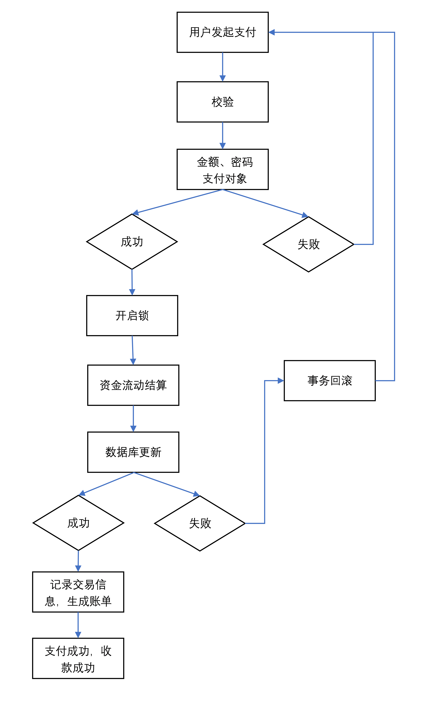

# QG资金管理系统
## 设计思路
* 前端使用JQuery框架，使用ajax发送请求与后端交互。后端采用传统的Servlet和MVC三层架构进行开发
* 首先拿到项目时，先分析整个系统要实现的功能，从而确定数据库需要用到哪些表，表中需要存哪些数据。然后仔细思考从哪开始下手实现，规划好后面每天需要实现的功能。
* 经过考虑之后，我决定从最简单的功能开始，一点一点往系统里面加东西。在着手写后端代码之前，我会先将一些功能所对应的前端页面简单的搭建出来，这样能更好的知道哪些数据需要传输，功能该怎样实现。最开始我先把用户基本的登录、注册、找回密码完成，然后再搭建出用户中心，展示用户的基本信息，进而再实现用户可以修改基本信息的功能。之后再逐步实现企业群组，资金流动，网站管理员相关的功能。
* 我会在开发完一个功能时，就测试一下。看看有没有 bug，用户能不能顺利使用。有问题就改进，不断完善系统。
* 在基本功能实现完成之后，就开始着手一些进阶的需求，保证资金流动的安全和系统的稳定。
## 资金流动的原子性
* 支付和收款其实是一个相对应的过程，先开启一个事务，再校验输入的密码是否正确，自己所持有的金额是否足够，支付的对象是否存在，任何一个地方有问题就中止支付。这些信息校验成功没有问题之后，开启锁，保证这个过程同时只有一个进程在进行，然后进行资金结算，双方的数据库存储的金额数进行更新。如果数据库更新出现错误时，支付也会停止，事务回滚，任何执行了的过程全部回到原始状态。当一切操作都没有问题时，资金结算成功，并同时记录交易信息，双方都会有流水账单信息。
* 流程图：

## 亮点
* 用户登录时需要输入验证码，保证用户的账户安全
* 用户执行操作后，前端展示的数据会实时更新
* 使用了lomback日志实时监控系统运行状态，可以记录运行关键部分和异常情况
* 企业群组内有聊天室的功能，同属于一个企业群组的用户可以一个专属的聊天室聊天。
* 使用了javax.mail,用户或企业被封禁了，可以向网站管理员发送邮件来申请解封
* 在转账资金流动过程中用到了锁和事务，保证资金流动的安全
* 流水账单可以打印输出为txt文件